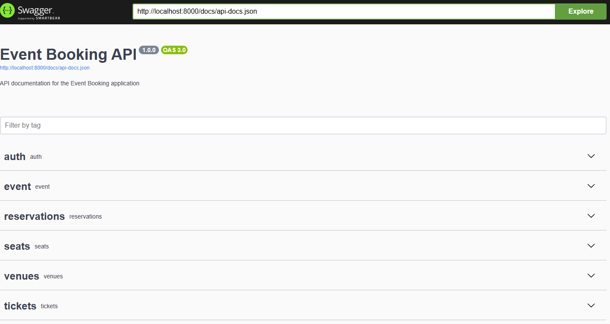

<p align="center"><a href="https://laravel.com" target="_blank"></a></p>

## Event Booking API

----------

# _Getting started_

## Installation

Please check the official laravel installation guide for server requirements before you start. [Official Documentation](https://laravel.com/docs/5.4/installation#installation)

<h3>Dependencies require a PHP version ">= 8.1.0".</h2>
To ensure your project works correctly, you need to enable the following extensions in your php.ini file:

```ini
extension=fileinfo
extension=pdo_mysql
extension=openssl
```

To do this, open your php.ini file and remove the ; character at the beginning of the lines above to enable them. After saving and closing the file, restart your web server.

Clone the repository

```sh
git clone https://github.com/kaankarakaas/event-booking-api.git
```

Switch to the repo folder

```sh
cd event-booking-api
```
Install all the dependencies using composer

```sh
composer install
```

Copy the example env file and make the required configuration changes in the .env file

```sh
cp .env.example .env
```

Generate a new application key

```sh
php artisan key:generate
```

Generate a new JWT authentication secret key

```sh
php artisan jwt:generate
```

Run the database migrations (**Set the database connection in .env before migrating**)

```sh
php artisan migrate
```

Start the local development server

```sh
php artisan serve
```

You can now access the server at http://localhost:8000

**TL;DR command list**

```sh
git clone git@github.com:kaankarakaas/event-booking-api.git
cd event-booking-api
composer install
cp .env.example .env
php artisan key:generate
php artisan jwt:generate 
```

**Make sure you set the correct database connection information before running the migrations** [Environment variables](#environment-variables)

```sh
php artisan migrate
php artisan serve
```

## Database seeding

**Populate the database with seed data with relationships which includes users, articles, comments, tags, favorites and follows. This can help you to quickly start testing the api or couple a frontend and start using it with ready content.**

Open the DatabaseSeeder and set the property values as per your requirement

    database/seeds/DatabaseSeeder.php

Run the database seeder and you're done

```sh
php artisan db:seed
```

***Note*** : It's recommended to have a clean database before seeding. You can refresh your migrations at any point to clean the database by running the following command

```sh
php artisan migrate:refresh
```


The api can be accessed at [http://localhost:8000/api/documentation](http://localhost:8000/api/documentation).

----------

# Code overview

## Dependencies

- [jwt-auth](https://github.com/tymondesigns/jwt-auth) - For authentication using JSON Web Tokens
- [laravel-dompdf](https://github.com/barryvdh/laravel-dompdf) - For Creating PDFs
- [l5-swagger](https://github.com/darkaonline/l5-swagger) - For API Documentation

## Folders
Here is an analysis of the folders in your project:

- `app` - Contains all the Eloquent models
- `app/Http/Controllers` - Contains all the controller files
- `app/Http/Middleware` - Contains all the middleware files
- `app/Providers` - Contains all the service providers
- `config` - Contains all the application configuration files
- `database` - Contains all the database-related files
    - `database/factories` - Contains all the model factories
    - `database/migrations` - Contains all the database migration files
    - `database/seeds` - Contains all the database seed files
- `routes` - Contains all the route definitions
- `storage` - Contains all the storage files

This structure is typical for a Laravel project, organizing different parts of the application into specific directories for better maintainability and clarity.

## Environment variables

- `.env` - Environment variables can be set in this file

***Note*** : You can quickly set the database information and other variables in this file and have the application fully working.

----------

# Testing API

Run the laravel development server

```sh
php artisan serve
```

The api can now be accessed at

```sh
http://localhost:8000/api/documentation
```

Request headers

| **Required** 	| **Key**              	| **Value**            	|
|----------	|------------------	|------------------	|
| Yes      	| Content-Type     	| application/json 	|
| Yes      	| X-Requested-With 	| XMLHttpRequest   	|
| Optional 	| Authorization    	| Token {JWT}      	|


- [Postman Collection](postman-collection.json)

----------
 
# Authentication

This applications uses JSON Web Token (JWT) to handle authentication. The token is passed with each request using the `Authorization` header with `Token` scheme. The JWT authentication middleware handles the validation and authentication of the token. Please check the following sources to learn more about JWT.

- https://jwt.io/introduction/
- https://self-issued.info/docs/draft-ietf-oauth-json-web-token.html

----------

# Cross-Origin Resource Sharing (CORS)

This applications has CORS enabled by default on all API endpoints. The default configuration allows requests from `http://localhost:3000` to help speed up your frontend testing. The CORS allowed origins can be changed by setting them in the config file. Please check the following sources to learn more about CORS.

- https://developer.mozilla.org/en-US/docs/Web/HTTP/Access_control_CORS
- https://en.wikipedia.org/wiki/Cross-origin_resource_sharing
- https://www.w3.org/TR/cors

# ScreenShot

